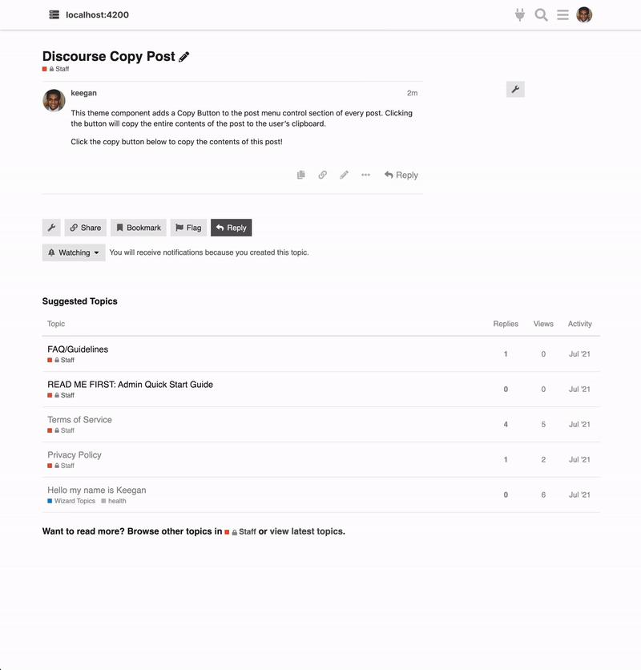

# Discourse Copy Post

This theme component adds a 📄 Copy Button to the post menu control section of every post. Clicking the button will copy the entire contents of the post to the user's clipboard.

